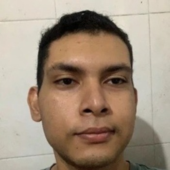

## ¿ Quien Soy ?

<!--  -->

Soy Robert un desarrollador web que tiene a la Administración de Comercio internacional, comencé a incursionarme al mundo
de la programación en el año 2020, justo cuando comenzaban las restricciones para tratar de contener a la COVID 19 en mi
país, justo después de graduarme.

## Mi camino en la programación

Siempre me he interesado en la informatica/computación, pero por varias razones terminé estudiando otra carrera que tienen
poco o nada que ver con esta. Cuando me gradué de la universidad en 2020, entré en un periodo de incertidumbre ya que
muchas empresas tuvieron que cerrar lo que conllevó a que hubiera menos empresas con capacidad para contratar nuevos
trabajadores especialmente recién graduados.
Por lo tanto no me quedé con los brazos cruzados, y volví a tomar cursos, especialmente en la página web "FreeCodeCamp.org",
a la cual le debo un montón.

Al año siguiente (2021) tuve la oportunidad de presentarme al programa Misión Tic 2022, que buscaba llevar a la mayor cantidad
de colombianos hacia un futuro como trabajadores en las tecnologías de la cuarta revolución industrial. La universidad que
escogí para llevar a cabo este programa fué la universidad del norte en Barranquilla, aunque la formación fue totalmente
virtual, y el enfoque que escogí fué el desarrollo web (el otro era el desarrollo para dispositivos moviles).